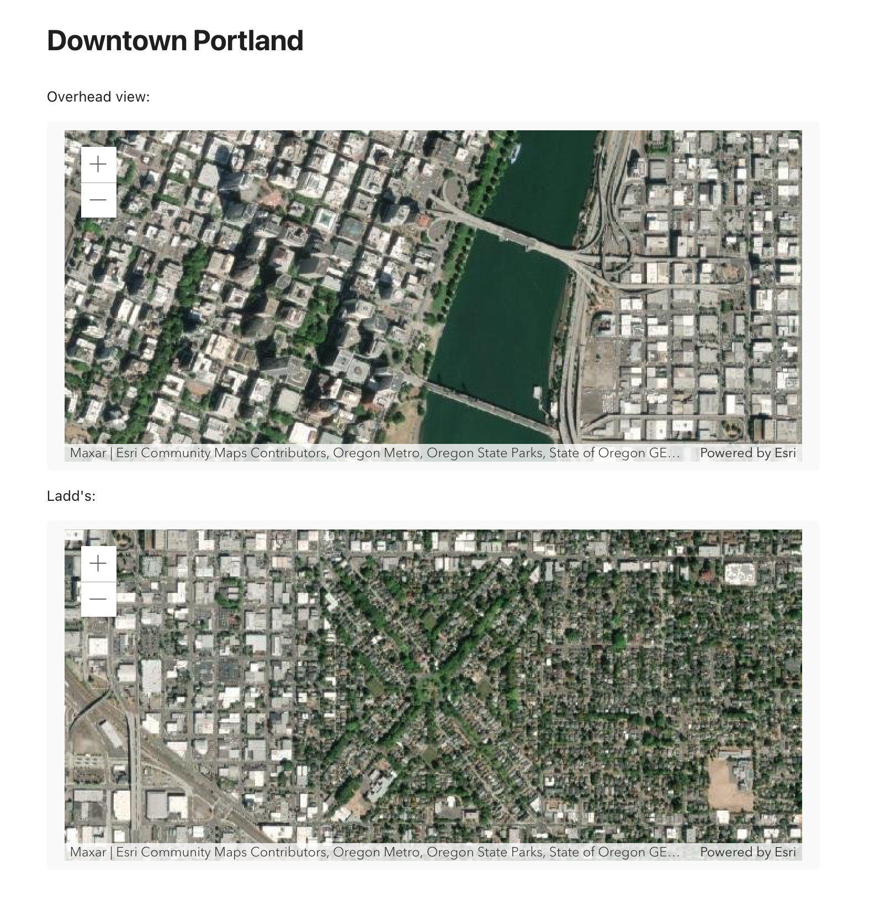

# ArcGIS in Obsidian

Experimental project to integrate Obsidian and ArcGIS using the ArcGIS API for JavaScript.

> **Note**: This project is for my own education, and due to limitations mentioned below is not suitable for production use.

## Features

- **Sync notes with feature service**: Specify geographic locations in note frontmatter, then sync notes to a feature service to automatically map your Obsidian vault. Features include a link back to the vault, so you can easily navigate between your map and your vault.
- **Embed a basic map in a note**: To embed a map view showing a basemap, add a code block with the language set to `arcgis`.

      ```arcgis
      basemap: imagery
      ```
- **Embed a web map by ID**: To embed a web map, add a code block with arcgis language and set an id:

      ```arcgis
      id: 64df037d4b3949a68398d3f20da78c17
      ```
- **Define center and scale**: You can specify the center of the initial viewpoint and the initial scale:

      ```arcgis
      basemap: arcgis-imagery
      center: [-122.64932766603697, 45.50838206781943]
      zoom: 15
      ```

Simple maps embedded in note:



## Limitations

- The ArcGIS API does not support loading images in a node environment. For development use, request.js can be patched to remove the node check, and imagery basemaps will work correctly, but that violates the terms of use.
- The ArcGIS API by default does not render vector tile layers in Electron apps where `nodeIntegrationInWorkers` is true, which appears to be the case for Obsidian.

